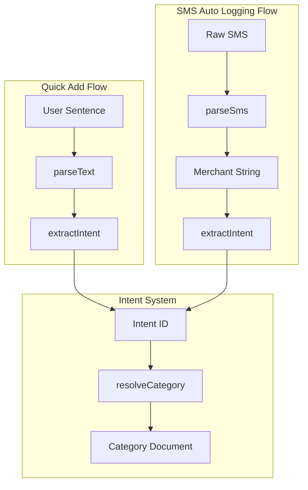

# Finova Intent System Audit

## 1. Executive Summary
The Finova Intent System was originally built for the **Quick Add (NLP)** feature to map natural language user inputs (e.g., "اشتريت قهوة") to a standardized internal semantic label (e.g., `coffee`), which is then mapped to the user's specific custom category. 

**Intent is a bridge, not a category.** It solves the problem of semantic variation. Instead of trying to directly map infinite user phrases to infinite custom category names, the system first maps the user's phrase to a bounded set of known **Intents**, and then maps the Intent to the user's categories using stored intent metadata and synonym heuristics.

## 2. Intent Architecture
The conceptual pipeline is strictly:
`Raw Text` → `Intent ID` → `User Category Object` → `Category ID`

1. **`extractIntent(text)`**: Takes raw text (from Quick Add NLP or SMS merchant field), normalizes it, and matches it against a predefined taxonomy, returning a string `intentId` (e.g., `'food_and_drink'`) or `null`.
2. **`resolveCategory(userId, intentId, type)`**: Takes the `intentId` and transaction `type` ('income' or 'expense'), queries the database for the *current user's* categories, and attempts to find the best match using strict confidence metrics and fallback synonyms.

## 3. `extractIntent()` Implementation
- **File:** `backend/services/quickAdd/nlpParser.js`
- **Input:** String (e.g., user sentence or SMS merchant name)
- **Output:** String (e.g., `'coffee'`) or `null`
- **Normalization:** 
  - `normalizeArabic(text)`: Removes diacritics, unifies letters (أ,إ,آ → ا), (ة → ه), (ى → ي), and lowercases.
  - `transliterateFranco(text)`: Maps Franco-Arabic letters/numbers to Arabic characters (e.g., '3' → 'ع', 'sh' → 'ش') using regex and dictionary maps.
- **Matching Logic:** 
  Iterates over all intents in `INTENTS`. For each intent, it counts occurrences of its `keywords` in both the normalized Arabic text and the Franco text using a regex: `(?:^|\s|[بفلك]|لل)${normKw}(?:\s|$)`. This regex allows for common Arabic prepositions/prefixes attached directly to the word.
- **Scoring:** Adds up the matches (`matches += Math.max(count1, count2)`).
- **Fallback:** If no keywords match across any intents, returns `null`.

## 4. Intent Taxonomy
*Defined in `backend/services/quickAdd/intentTaxonomy.js`*

| Intent ID | Meaning | Arabic / English Keywords |
| :--- | :--- | :--- |
| `food_and_drink` | General food | اكل، طعام، غدا، عشا، فطار، وجبة، food, meals, dining, akl |
| `restaurant` | Dining out | مطعم، مطاعم، restaurant, dine out, mat3am |
| `fast_food` | Junk food | كشري، شاورما، kfc, mcdonalds، ماك، بيتزا، pizza، برجر، burger |
| `coffee` | Cafes | قهوة، كوفي، كافيه، ستاربكس، starbucks، coffee، اسبريسو، cafe |
| `beverages` | Drinks | مشروب، عصير، بيبسي، مياه، شاي، drink, beverage, water |
| `desserts` | Sweets | حلو، حلويات، ايس كريم، كيك، dessert, ice cream, cake, sweets |
| `groceries` | Groceries | سوبر ماركت، بقالة، كارفور، سعودي، خضار، طلبات، talabat، groceries |
| `transportation` | Transport | تاكسي، مواصلات، اوبر، uber، مترو، ميكروباص، اتوبيس، كريم، careem |
| `bills` | Utilities/Rent | فاتورة، كهربا، ميه، غاز، نت، انترنت، ايجار، شحن، رصيد، bill, rent |
| `shopping` | Retail | لبس، ملابس، حذاء، قميص، تسوق، مول، سوق، امازون، amazon، نون |
| `entertainment` | Leisure | سينما، فيلم، خروجة، ترفيه، جيم، بلايستيشن، نادي، entertainment |
| `healthcare` | Medical | دكتور، صيدلية، علاج، دواء، طبيب، مستشفى، عيادة، health, doctor |
| `education` | School/Learning| كورس، جامعة، مدرسة، تعليم، دورة، كتب، education, school |
| `salary` | Income source | مرتب، راتب، شغل، قبض، سلفة، مكافأة، بونص، salary, income, work |
| `subscriptions` | Subs | اشتراك، نتفليكس، netflix، سبوتيفاي، spotify, subscription |

## 5. Matching and Priority Rules
If a sentence contains multiple intents (e.g., "اشتريت أكل من السوبر ماركت" contains `food_and_drink` and `groceries`), the system resolves it using a **Highest Count Wins** rule.
- `extractIntent()` counts total keyword occurrences per intent.
- The intent with the highest score (`maxScore`) wins.
- **Tie-Breaker:** If two intents have the exact same score, the **first one declared in the `INTENTS` array wins**. (Because `if (score > maxScore)` requires a strictly greater score to override). Therefore, `food_and_drink` (index 0) will beat `groceries` (index 6) if both have exactly 1 match.

## 6. Intent Resolver
- **File:** `backend/services/quickAdd/intentResolver.js`
- **Flow:**
  1. Filters by transaction type: `Category.find({ user: userId, type })` ensures an expense intent won't accidentally map to an income category.
  2. **High Confidence (Exact Match):** Finds a category where `c.intent === intentId && c.intentConfidence >= 0.8`.
  3. **Medium Confidence:** Finds a category where `c.intent === intentId && c.intentConfidence >= 0.5`.
  4. **Fallback (Synonym Heuristic):** If the category was never officially tagged with an intent (legacy data), the resolver takes `INTENT_SYNONYMS[intentId]` and checks if the user's category name contains any of the synonyms in Arabic or Franco.
- If no match is found across any of these 3 stages, it returns `null`.

## 7. User Category Resolution
Category resolution is **strictly user-scoped**. 
`Category.find({ user: userId, type })` guarantees that the resolver will only search the custom categories belonging to the specific user. It is architecturally impossible to resolve and return another user's category.

## 8. Quick Add End-to-End Flow
1. **User input:** "اشتريت قهوة بـ 50"
2. **NLP Parser:** `parseText(text, userAccounts)` is called.
3. **Intent Extraction:** `extractIntent("اشتريت قهوة بـ 50")` returns `'coffee'`.
4. **Transaction Structuring:** NLP parser returns an array of transaction drafts.
5. **Controller Loop:** `quickAddController.js` iterates over the drafts.
6. **Resolver:** `intentResolver.resolveCategory(req.user.id, 'coffee', 'expense')` is called.
7. **Database:** Finds user's "Coffee & Drinks" category.
8. **Creation:** Saves transaction with `category: resolvedCategory._id`.

## 9. Existing Examples
From `backend/test-quickadd.js`:
- `input`: `'اشتريت قهوة بـ50'` → `intent`: `'coffee'`
- `input`: `'دفعت 200 في مطعم'` → `intent`: `'restaurant'`
- `input`: `'اشتريت بيتزا بـ250'` → `intent`: `'fast_food'`
- `input`: `'ركبت تاكسي بـ100'` → `intent`: `'transportation'`
- `input`: `'اشتريت من matar3m بـ200'` → `intent`: `'restaurant'` (Franco support)

## 10. Test Coverage
Tests are located in `backend/test-quickadd.js`.
- **Coverage:** Highly tests the `extractIntent` output via the NLP parser. Asserts English, Arabic, and Franco extraction correctly.
- **Missing Coverage:** There are **NO unit tests** explicitly testing `intentResolver.js` or database category resolution logic. `test-quickadd.js` uses mocked accounts but does not mock the MongoDB Category collection, so it asserts `expectIntent` but not `expectCategory`.

## 11. Edge Cases
- **Empty/Null Input:** Returns `null`.
- **Numbers/Spelling variations:** Will fail unless explicitly covered in `INTENT_SYNONYMS` or `INTENTS` keywords.
- **Merchant names containing keywords:** If a merchant is named "Burger King", it will successfully match `burger` and return `fast_food`. If a merchant is named "Starbucks", it will return `coffee`.
- **Unknown Merchant:** Returns `null`.

## 12. SMS Auto Logging Compatibility
1. **Can SMS directly reuse `extractIntent()`?** Yes.
2. **Can SMS directly reuse `intentResolver`?** Yes.
3. **What input should be sent?** `extractIntent(parsedData.merchant)` is the safest input.
4. **Should it use the entire SMS?** No. Passing the full SMS body (e.g., "Transaction of EGP 500 at Uber via Card ending in 1984") could accidentally trigger intents from unrelated words. The `merchant` field ("Uber") provides the highest signal-to-noise ratio.
5. **Does transaction type affect it?** Yes, the resolver requires `parsedData.type` to ensure expense merchants don't map to income categories.

## 13. Reuse vs Duplication
**Currently, SMS Auto Logging IS ALREADY REUSING the Intent system.**
In `backend/controllers/smsWebhookController.js` (Lines 66-73):
```javascript
inferredIntent = extractIntent(parsedData.merchant);
if (inferredIntent) {
  const resolvedCategory = await resolveCategory(user._id, inferredIntent, parsedData.type);
  // ...
```
There is **no duplication** of categorization logic. The SMS system leverages the exact same pipeline as Quick Add for determining categories. 

## 14. Current Limitations
- **Overlapping/Ambiguous Keywords:** Because it uses a Highest Count / First Match rule, sentences like "اشتريت اكل للقطة" (I bought food for the cat) will trigger `food_and_drink` because 'اكل' is a keyword, even though it's a pet expense. 
- **Short Merchants:** A merchant named "ب" would theoretically be skipped or mis-parsed, though the regex word boundaries `(?:^|\s)` help prevent partial inside-word matches.
- **Missing Categories:** If the user has heavily customized their categories and deleted standard ones (and never linked them to intents via the UI), the fallback synonym heuristic might fail, leaving the transaction uncategorized.

## 15. Architectural Dependencies
`smsWebhookController` → `extractIntent` (`nlpParser.js`) → `INTENTS` (`intentTaxonomy.js`)
`smsWebhookController` → `resolveCategory` (`intentResolver.js`) → `Category` Model (`models/Category.js`) + `INTENT_SYNONYMS` (`intentTaxonomy.js`)

## 16. Recommended Reuse Boundary
The current implementation in `smsWebhookController.js` represents the ideal reuse boundary:
- SMS Parser exclusively handles SMS regex, amounts, and string isolation (Merchant).
- Intent System exclusively handles Semantic Labeling (`merchant` → `intent`).
- Category System exclusively handles User Mapping (`intent` → `category._id`).

## 17. Current vs Potential Architecture
The architecture is already in its optimal potential state.



## 18. Things Another AI Agent MUST Know
1. **Intent ≠ Category.** Intent is a system-level string (`'coffee'`). Category is a user-specific MongoDB document. Do not attempt to save an Intent directly to a Transaction's `category` field.
2. **Do not pass full SMS text to `extractIntent()`.** Only pass the isolated merchant name.
3. **Intent resolution requires transaction `type`.** Always pass 'income' or 'expense' to `resolveCategory` to prevent cross-contamination.
4. **Tie-Breaking is Array-Order Dependent.** If two intents have equal matches, the one declared first in `intentTaxonomy.js` wins.

## 19. Final Conclusion
The Finova Intent System is highly decoupled, well-architected for Arabic/Franco NLP, and safely user-scoped. The SMS Auto Logging feature is **already correctly reusing** this system by passing the extracted merchant name into the Intent pipeline. No further architectural bridging is required; any future improvements should focus on expanding the `INTENT_SYNONYMS` or `INTENTS` taxonomy rather than rewriting the integration.
