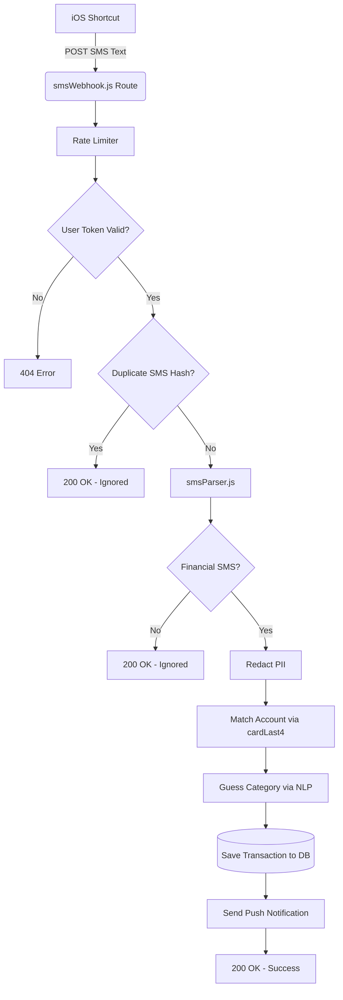

# Finova SMS Auto Logging Documentation

## 1. FEATURE OVERVIEW
The SMS Auto Logging feature allows users to seamlessly track expenses and incomes without manual entry. By forwarding bank and wallet SMS messages from their phone (typically via iOS Shortcuts) to a dedicated webhook, Finova automatically parses the message, extracts the transaction details (amount, merchant, date, etc.), links it to the correct account, categorizes it using NLP, and logs it as a transaction pending manual review.

**Key capabilities:**
- Detects Expenses, Incomes, and Transfers (IPN).
- Extracts transaction amount, currency, merchant/payee name, reference numbers, and card details.
- Automatically maps the SMS to a registered bank account/wallet based on the last 4 digits of the card/wallet.
- Redacts sensitive PII (Personally Identifiable Information) before saving to the database.

## 2. COMPLETE END-TO-END FLOW
1. **SMS Received:** The user receives a financial SMS on their phone.
2. **Forwarding to Backend:** An iOS Shortcut triggers and sends a POST request with the SMS body to the webhook URL (`/api/sms/webhook/:userToken`).
3. **Authentication:** The `smsWebhookController.js` (`handleSmsWebhook`) finds the user matching the `:userToken`.
4. **Deduplication:** The controller generates a SHA-256 hash of the raw SMS text and checks the `Transaction` collection for an existing `smsHash` for this user. If found, it returns `200 OK` without creating a duplicate.
5. **PII Redaction:** The controller passes the raw text to a `redactSensitiveInfo` function to mask card numbers, available balances, and person names.
6. **Parsing:** `smsParser.js` (`parseSms`) checks the text against an array of regex templates (`BANK_PATTERNS`). If no template matches, it uses a "Smart Fallback" looking for financial keywords.
7. **Account Linking:** If `cardLast4` is extracted, the controller queries the `Account` model to find the matching account for the user.
8. **Categorization:** `nlpParser.js` (`extractIntent`) and `intentResolver.js` (`resolveCategory`) attempt to guess the category based on the extracted merchant name.
9. **Database Persistence:** A new `Transaction` is created with `status: 'needs_manual_review'` and `source: 'sms_shortcut'`.
10. **Push Notification:** `notificationService.js` sends a push notification to the user prompting them to review the new transaction.
11. **Response:** The API returns `200 OK` back to the iOS Shortcut.

## 3. SMS INPUT
- **Entry Point:** POST request to `/api/sms/webhook/:userToken` (`backend/routes/smsWebhook.js`).
- **Payload Schema:** 
  - The endpoint accepts both JSON and raw text.
  - JSON format: `{ "text": "sms body" }` or `{ "sms": "sms body" }`.
  - Raw text: The raw body string.
- **Requirements:** 
  - The feature does NOT rely on a "sender" field (e.g., "CIB" or "Vodafone"). It strictly parses the message body.
  - Dependent on an external automation trigger (like iOS Shortcuts) to make the HTTP POST request.

## 4. PARSING LOGIC
Located in `backend/services/smsParser.js`.

The parser strictly attempts to match the SMS against an array of predefined regex templates (`BANK_PATTERNS`). If a match is found, it extracts specific regex groups for `amount`, `merchant`, `cardLast4`, etc.

If no strict template matches, it triggers a **Smart Fallback**:
1. Checks for financial keywords: `/(خصم|شراء|إيداع|ايداع|اضافة|إضافة|استلام|استلمت|تحويل|سحب|مبلغ|transaction|transfer|payment|paid|charged|recharged|purchase|debited|withdrawal)/i`
2. Uses `extractAmountFallback` to find numbers near currency keywords (EGP, L.E, جم).
3. Uses `extractCardFallback` to find masked 4-digit card endings (e.g., `ending in 1234` or `****1234`).
4. Attempts to isolate the merchant by looking after words like `عند`, `لـ`, `to`, or `@`.

## 5. SUPPORTED SMS FORMATS
Found in `backend/services/smsParser.js` (`BANK_PATTERNS` array).

### Arabic Formats:
- **Prepaid Transfer Out:** Identifies `/تم تنفيذ تحويل لحظي.*بمبلغ/i`. Extracts amount, merchant (after `إلى`), and reference number.
- **Prepaid Transfer In:** Identifies `/تم إضافة تحويل لحظي.*بمبلغ/i`. Extracts amount, merchant (after `من`), and reference number.
- **Prepaid Purchase / POS:** Identifies `/تم خصم.*من بطاقة.*عند/i`. Extracts amount, cardLast4, merchant (after `عند`), and available balance.
- **Instapay Purchase:** Identifies `/تم خصم مبلغ.*باستخدام شبكة المدفوعات اللحظية/i`.
- **Vodafone Cash:** Supports payment, withdrawal, and received messages.
- **Banque Misr POS:** Identifies `/بطاقة بنك مصر.*تم الآن خصم.*عند/i`.
- **ADIB / IPN General:** Supports IPN transfers and general income/expense.

### English Formats:
- **Successful Transaction:** Identifies `/Successful transaction of/i`. Extracts cardLast4 and merchant (after `@`).
- **IPN Transfer Received:** Identifies `/IPN transfer received/i`.
- **IPN Transfer Sent:** Identifies `/IPN transfer sent/i`.
- **Vodafone Cash:** Supports transfer sent and recharge.

**Missing fields handling:** If a field like `cardLast4` or `merchant` is missing from the SMS, the parser sets them to `null` or falls back to generic strings (e.g., "IPN Transfer", "Vodafone Cash").

## 6. VALIDATION
- **Amount:** Enforced by Mongoose `Transaction.js` schema (`v >= 0` for income and expense).
- **Required Fields:** `source === 'sms_shortcut'` bypasses the strict `account` and `category` requirement in the `Transaction.js` schema (they remain optional until the user reviews them).
- **Rejection / Non-Financial SMS:** If the parser returns `null` (because no pattern matched and no fallback financial keywords were found), the controller returns `200 OK` with a message `"Ignored: not a recognized financial transaction"`. This prevents the iOS Shortcut from showing a failure notification to the user for irrelevant SMS messages.

## 7. DUPLICATE / IDEMPOTENCY HANDLING
Yes, the feature prevents duplicates using cryptographic hashing.

- **How it works:** A SHA-256 hash is generated from the raw SMS text in `smsWebhookController.js` (`const smsHash = crypto.createHash('sha256').update(smsText).digest('hex');`).
- **Detection:** It queries `Transaction.findOne({ user: user._id, smsHash })`.
- **Action:** If found, the API gracefully aborts and returns `200 OK` (`"Transaction already exists (deduplicated)"`). 
- **Database Index:** `Transaction.js` has a sparse index on `smsHash`: `transactionSchema.index({ user: 1, smsHash: 1 }, { sparse: true });`.

## 8. DATABASE
**Model:** `backend/models/Transaction.js`

**Populated Fields:**
- `user`: User ID from token.
- `title`: Extracted `merchant` or fallback `"معاملة SMS (تحتاج مراجعة)"`.
- `amount`: Extracted from SMS.
- `type`: 'income' or 'expense'.
- `account`: Mapped ObjectId (if `cardLast4` matches an `Account`).
- `category`: Mapped ObjectId (if NLP guesses the category).
- `status`: Set explicitly to `'needs_manual_review'`.
- `source`: Set explicitly to `'sms_shortcut'`.
- `referenceNumber`: Extracted reference number.
- `rawSms`: The exact SMS text, modified by `redactSensitiveInfo`.
- `smsHash`: The SHA-256 hash of the SMS.

## 9. API / BACKEND
- **Route:** `POST /api/sms/webhook/:userToken` (`backend/routes/smsWebhook.js`).
- **Middleware:** `smsLimiter` (Rate Limiting: 50 requests / 15 mins).
- **Controller:** `backend/controllers/smsWebhookController.js`.
- **Services:**
  - `backend/services/smsParser.js` (Regex rules).
  - `backend/services/notificationService.js` (Push notifications).
  - `backend/services/quickAdd/nlpParser.js` (Extract intent for category).
  - `backend/services/quickAdd/intentResolver.js` (Resolve intent to Category ID).

## 10. FRONTEND
The frontend is primarily responsible for surfacing the webhook URL so the user can configure their iOS Shortcut.
- **Settings Page:** `frontend/src/pages/Settings.jsx`.
  - Exposes the webhook URL as a copyable input: `https://finova-zzr7.onrender.com/api/sms/webhook/${smsToken}`.
  - Uses `user.smsWebhookToken` fetched from the API.
- **Onboarding:** `frontend/src/components/Onboarding/EffortlessTrackingStep.jsx`.
  - Contains UI animations explaining the SMS Auto-Logging feature to new users.

## 11. SECURITY
- **Authentication:** Relies entirely on the `smsWebhookToken` embedded in the URL path. This token is a random 16-byte hex string generated upon User creation (`backend/models/User.js`).
- **PII Redaction:** Card numbers, available balances, and names are scrubbed via regex before the SMS is written to `rawSms` in the database.
- **Rate Limiting:** Limited to 50 requests per 15 minutes per IP to prevent spamming.
- **Potential Weaknesses:** 
  - URL-based authentication means if the webhook URL leaks, malicious actors can insert transactions into the user's account.
  - No signature verification (HMAC) to prove the request actually came from the user's Apple device.
  - Spoofed payloads are possible since the payload format is just arbitrary text.

## 12. ERROR HANDLING
- **Empty Payload:** Returns `400 Bad Request` (`"Empty SMS body"`).
- **Invalid Token:** Returns `404 Not Found` (`"Invalid webhook token"`).
- **Duplicate SMS:** Returns `200 OK` (graceful exit).
- **Unrecognized SMS:** Returns `200 OK` (graceful exit).
- **Internal Server Error:** Returns `500` with generic message, logs stack trace to console.
- **Push Notification Failure:** Caught in a try/catch block. If push fails, the transaction is still successfully saved to the database.

## 13. TESTS
**Test File:** `backend/test-webhook.js`

**Scenarios Covered:**
1. Valid SMS matching an account (via `cardLast4`).
2. Duplicate SMS processing (verifying it doesn't create two transactions).
3. SMS with no account match (verifying it creates the transaction with `account: null`).
4. Invalid webhook token (expects 404).
5. Rate Limiting (fires 101 requests to verify `429 Too Many Requests`).

**Not Covered by Tests:**
- The NLP categorization mapping.
- PII Redaction logic (not explicitly asserted in tests).

## 14. CONFIGURATION / ENVIRONMENT
- **Environment Variables:** None explicitly required for this feature beyond the standard DB/Port config.
- **Hardcoded URLs:** The frontend (`Settings.jsx`) hardcodes the production URL `https://finova-zzr7.onrender.com/api/sms/webhook/` for the copy-to-clipboard functionality.

## 15. FILE MAP
```text
SMS Auto Logging
├── backend/routes/smsWebhook.js                 # Express router mapping POST to controller
├── backend/controllers/smsWebhookController.js  # Main orchestration, deduplication, redaction
├── backend/services/smsParser.js                # Core regex rules and fallback extraction logic
├── backend/models/Transaction.js                # Database schema for the transaction
├── backend/models/User.js                       # Database schema storing smsWebhookToken
├── backend/services/quickAdd/nlpParser.js       # Natural language processor to guess intent
├── backend/services/quickAdd/intentResolver.js  # Maps guessed intent to a Category ID
├── frontend/src/pages/Settings.jsx              # UI for exposing the Webhook URL to the user
└── backend/test-webhook.js                      # Test suite for webhook flow
```

## 16. ACTUAL ARCHITECTURE


## 17. CRITICAL IMPLEMENTATION DETAILS (Things Another AI Agent MUST Know)
1. **Fallback 200 OK Responses:** The backend purposely returns a `200 OK` for duplicate SMS and non-financial SMS messages. This is CRITICAL. If it returned a `400` or `500`, the iOS Shortcuts app would pop up a disruptive error notification on the user's phone every time they receive a normal text message.
2. **Transaction Required Fields Bypass:** A standard Transaction in Finova requires an `account` and `category`. However, the Mongoose schema for `Transaction` has a conditional check: `if (this.source === 'sms_shortcut') return false;`. Do not inadvertently remove this, or SMS auto-logging will start throwing Mongoose validation errors when it can't match an account.
3. **Hardcoded Frontend URL:** The frontend generates the webhook URL with a hardcoded host: `https://finova-zzr7.onrender.com...`. If you change environments, this must be updated manually.
4. **NLP Re-use:** The category guessing reuses the `quickAdd` NLP logic (`nlpParser.js`). Modifying the NLP parser for Voice/Text Quick Add will directly impact SMS Auto-Logging accuracy.
5. **PII Redaction is Destructive:** The `redactSensitiveInfo` function alters the raw SMS before saving. You cannot recover the exact original text or card number from the database once saved.
6. **Token Generation:** The `smsWebhookToken` is generated implicitly inside `User.js` using `default: () => require('crypto').randomBytes(16).toString('hex')`. It is not generated in the auth controllers.
