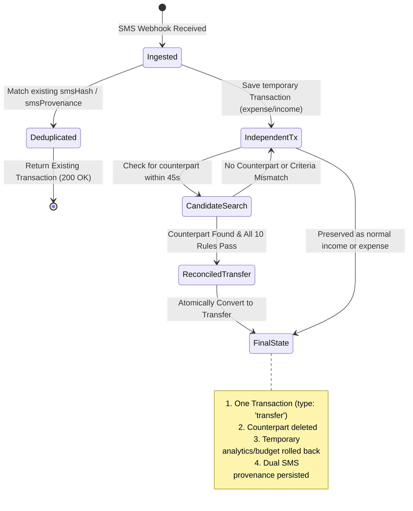

# Data Model: SMS Account Detection & Self-Transfer Reconciliation

**Feature**: `001-sms-transfer-reconciliation`  
**Date**: 2026-09-18  
**Status**: Completed  

---

## 1. Entities & Schema Enhancements

### `Transaction` Model (Mongoose)

Existing fields retained:
- `user`: ObjectId (ref `User`, indexed, required)
- `title`: String
- `amount`: Number (required, positive)
- `type`: Enum `['income', 'expense', 'transfer', 'settlement']` (required)
- `date`: Date (required, default `Date.now`)
- `source`: Enum `['manual', 'sms_shortcut', 'system', 'apple_shortcut']`
- `referenceNumber`: String
- `rawSms`: String (PII redacted)
- `smsHash`: String (indexed)
- `idempotencyKey`: String (indexed, unique sparse)
- `account`: ObjectId (ref `Account`, required for income/expense)
- `from_account`: ObjectId (ref `Account`, required for transfer)
- `to_account`: ObjectId (ref `Account`, required for transfer)
- `category`: ObjectId (ref `Category`)

#### New Fields for Self-Transfer Provenance & Dual SMS Tracking

```javascript
// On Transaction schema
smsProvenance: [
  {
    smsHash: { type: String, required: true },
    direction: { type: String, enum: ['outgoing', 'incoming'], required: true },
    accountLast4: { type: String },
    account: { type: mongoose.Schema.Types.ObjectId, ref: 'Account' },
    referenceNumber: { type: String },
    eventTimestamp: { type: Date },
    receivedAt: { type: Date, default: Date.now }
  }
],
smsDirection: {
  type: String,
  enum: ['outgoing', 'incoming', null],
  default: null
}
```

#### New Indexes
```javascript
// Allow fast O(1) deduplication check across both legacy smsHash and reconciled transfers
transactionSchema.index(
  { user: 1, 'smsProvenance.smsHash': 1 },
  { sparse: true }
);

// Pair idempotency key lookup for concurrent transfer creation prevention
transactionSchema.index(
  { user: 1, idempotencyKey: 1 },
  { unique: true, partialFilterExpression: { idempotencyKey: { $type: 'string' } } }
);
```

---

## 2. In-Memory Parsed SMS Structure (`smsParser.js`)

```typescript
interface ParsedSmsResult {
  amount: number;
  currency: string;             // 'EGP'
  type: 'expense' | 'income';   // Temporary financial classification
  direction: 'outgoing' | 'incoming'; // Directional metadata for pairing
  accountLast4: string | null;  // Normalized 4-digit account string
  cardLast4: string | null;     // Backward compatibility alias for accountLast4
  merchant: string | null;      // Extracted merchant / counterparty
  referenceNumber: string | null; // Normalized reference code
  eventTimestamp: Date | null;  // Parsed from SMS text if complete, else null
  rawSms: string;               // Original raw text
  balanceAfter: number | null;  // If present in SMS
  confidence: 'high' | 'low';
}
```

---

## 3. Transaction State Lifecycle & Transitions



---

## 4. Reconciled Transfer Invariants

When two SMS messages are reconciled into a single transfer, the final transaction document MUST satisfy:
1. `type === 'transfer'`
2. `source === 'sms_shortcut'`
3. `amount === incoming.amount === outgoing.amount`
4. `from_account === accountEnding0694._id`
5. `to_account === accountEnding4113._id`
6. `from_account._id !== to_account._id`
7. `account === null || account === undefined`
8. `category === null || category === undefined`
9. `smsProvenance.length === 2`
10. `idempotencyKey === sha256(min(hash1, hash2) + ':' + max(hash1, hash2))`
