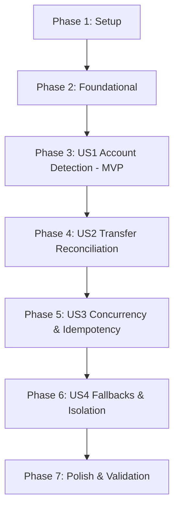

# Tasks: SMS Account Detection Recovery & IPN Self-Transfer Recognition

**Feature**: `001-sms-transfer-reconciliation`  
**Date**: 2026-09-18  
**Spec**: [spec.md](spec.md) | **Plan**: [plan.md](plan.md)  

---

## Phase 1: Setup (Shared Infrastructure)

**Purpose**: Verify development environment and establish testing baseline

- [x] T001 Verify baseline SMS regression suite by running `node backend/test-sms-regression.js`
- [x] T002 [P] Configure domain pairing window constant `SMS_TRANSFER_PAIRING_WINDOW_SECONDS = 45` in `backend/services/transferReconciliationService.js`

---

## Phase 2: Foundational (Blocking Prerequisites)

**Purpose**: Core database schema and index updates required by all user stories

**⚠️ CRITICAL**: Must complete before user story implementation begins

- [x] T003 Update Mongoose schema in `backend/models/Transaction.js` to add `smsDirection` enum `['outgoing', 'incoming', null]` and `smsProvenance` array with fields `smsHash` (String, required), `direction` (enum `['outgoing', 'incoming']`, required), `accountLast4` (String), `account` (ObjectId, ref `'Account'`), `referenceNumber` (String), `eventTimestamp` (Date), and `receivedAt` (Date, default `Date.now`)
- [x] T004 [P] Add compound sparse index `{ user: 1, 'smsProvenance.smsHash': 1 }` and ensure unique sparse index `{ user: 1, idempotencyKey: 1 }` in `backend/models/Transaction.js`

**Checkpoint**: Database schema and indexes ready — user story implementation can begin

---

## Phase 3: User Story 1 - Explicit Account Detection & Zero-Guessing Resolution (Priority: P1) 🎯 MVP

**Goal**: Restore explicit bank/card account extraction for Arabic (`إلى حسابكم 4113`) and English (`from 0694 on`) SMS formats with Arabic-Indic numeral normalization and zero-guessing account resolution scoped strictly to the authenticated user.

**Independent Test**: Run `node backend/test-sms-regression.js` to verify that Arabic and English IPN messages explicitly extract the correct 4-digit accounts (`0694` and `4113`), normalize Arabic-Indic digits, and leave un-matched or ambiguous accounts as `null` without guessing.

### Tests for User Story 1 🧪

- [x] T005 [P] [US1] Add unit test cases for Arabic IPN `إلى حسابكم 4113`, English IPN `from 0694 on`, and Arabic-Indic digit strings in `backend/test-sms-regression.js`
- [x] T006 [P] [US1] Add adversarial test cases verifying that reference numbers, transaction IDs, balances, and phone numbers are never extracted as accounts in `backend/test-sms-regression.js`

### Implementation for User Story 1

- [x] T007 [P] [US1] Implement numeral normalization converting Arabic-Indic digits (`٠١٢٣٤٥٦٧٨٩`) to ASCII (`0123456789`) and whitespace cleaning in `backend/services/smsParser.js`
- [x] T008 [US1] Update `BANK_PATTERNS` and `extractCardLast4` in `backend/services/smsParser.js` to explicitly match `إلى حسابكم 4113`, `from 0694 on`, and extract `direction` (`'outgoing'` vs `'incoming'`), `referenceNumber`, and `eventTimestamp`
- [x] T009 [P] [US1] Create isolated account resolver module in `backend/services/accountResolver.js` implementing `resolveUserAccount(userId, accountLast4)` with strict `{ user: userId, cardLast4: accountLast4, isArchived: { $ne: true } }` filtering and zero-guessing rules (returning `null` if 0 or >1 matches)
- [x] T010 [US1] Integrate `resolveUserAccount` in `backend/controllers/smsWebhookController.js` to set `account: accountId` deterministically

**Checkpoint**: User Story 1 functional and independently testable via `backend/test-sms-regression.js`

---

## Phase 4: User Story 2 - Instant Self-Transfer Detection & Atomic Reconciliation (Priority: P1)

**Goal**: Detect and atomically reconcile matching outgoing and incoming SMS transactions arriving within 45 seconds into a single `transfer` transaction, reversing temporary expense/income metrics and category budget spend.

**Independent Test**: Send an outgoing SMS (`0694`, 350 EGP) and an incoming SMS (`4113`, 350 EGP) within 45 seconds; verify exactly 1 `transfer` transaction exists (`from_account: 0694`, `to_account: 4113`) with 0 net balance impact and zero leftover income/expense records.

### Tests for User Story 2 🧪

- [x] T011 [P] [US2] Create integration test harness in `backend/test-sms-transfer-integration.js` covering outgoing-first and incoming-first arrival sequences within the 45s window

### Implementation for User Story 2

- [x] T012 [US2] Create transfer reconciliation service in `backend/services/transferReconciliationService.js` implementing candidate search within `SMS_TRANSFER_PAIRING_WINDOW_SECONDS = 45` and validating all 10 strict pairing rules
- [x] T013 [US2] Implement atomic reconciliation transaction using `withRetry` and `session.withTransaction` in `backend/services/transferReconciliationService.js` to convert the primary record to `type: 'transfer'`, set `from_account`, `to_account`, `referenceNumber`, title `"تحويل ذاتي (IPN)"`, and delete the superseded temporary counterpart
- [x] T014 [US2] Implement rollback of temporary analytics deltas (`applyTransactionDelta(userId, counterpart, -1)`) and temporary budget spent amounts (`updateBudgetIncrementally(userId, counterpartExpense, -1, session)`) upon transfer reconciliation in `backend/services/transferReconciliationService.js`
- [x] T015 [US2] Integrate `attemptTransferReconciliation` in `backend/controllers/smsWebhookController.js` immediately following temporary transaction persistence
- [x] T016 [US2] Add dedicated self-transfer reconciliation push notification dispatch in `backend/controllers/smsWebhookController.js` per FR-015

**Checkpoint**: User Stories 1 and 2 functional and testable; self-transfers atomically consolidate with zero cash-flow distortion

---

## Phase 5: User Story 3 - Concurrency, Retry & Replay Idempotency (Priority: P2)

**Goal**: Guarantee race condition immunity for near-simultaneous message deliveries and deduplication safety for replayed or retried webhook calls.

**Independent Test**: Replay either or both SMS messages of a reconciled transfer; verify `200 OK` deduplication response with no duplicate records created.

### Tests for User Story 3 🧪

- [x] T017 [P] [US3] Add duplicate delivery and replay test cases for single and paired SMS messages in `backend/test-sms-transfer-integration.js`
- [x] T018 [P] [US3] Add near-simultaneous arrival concurrency test cases in `backend/test-sms-transfer-integration.js`

### Implementation for User Story 3

- [x] T019 [US3] Implement deterministic transfer pair idempotency key `sha256(minHash + ':' + maxHash)` stored on `Transaction.idempotencyKey` and populated in `smsProvenance` array in `backend/services/transferReconciliationService.js`
- [x] T020 [US3] Update deduplication check in `backend/controllers/smsWebhookController.js` to query both `smsHash: smsHash` and `'smsProvenance.smsHash': smsHash` before processing incoming webhook payloads

**Checkpoint**: Webhook calls are 100% idempotent and race-condition resilient

---

## Phase 6: User Story 4 - Independent Transaction & Unpaired Fallback Preservation (Priority: P3)

**Goal**: Ensure legitimate one-sided payments, purchases, delayed messages (>45s), and conflicting references remain preserved as independent expense or income records without false pairing.

**Independent Test**: Submit messages with different reference numbers, identical source/destination accounts, or arriving >45 seconds apart; verify each remains an independent transaction.

### Tests for User Story 4 🧪

- [x] T021 [P] [US4] Add negative integration test cases in `backend/test-sms-transfer-integration.js` for delayed arrivals (>45s), mismatched references, same account on both sides, and cross-user isolation

### Implementation for User Story 4

- [x] T022 [US4] Add strict fallback preservation logic in `backend/services/transferReconciliationService.js` ensuring transactions remain independent when any pairing rule fails
- [x] T023 [US4] Implement strict multi-tenant boundary checks in `backend/services/transferReconciliationService.js` ensuring candidate searches and account resolutions never match across users

**Checkpoint**: All user stories fully functional with complete edge-case and isolation guarantees

---

## Phase 7: Polish & Cross-Cutting Concerns

**Purpose**: Security verification, ReDoS safety audit, documentation, and final end-to-end execution

- [x] T024 [P] Audit all regular expressions in `backend/services/smsParser.js` for linear complexity and ReDoS immunity
- [x] T025 [P] Verify concise production logging per Finova standards (`[ERROR]`, `[SMS Webhook]`) with zero sensitive PII in `backend/controllers/smsWebhookController.js`
- [x] T026 Execute full end-to-end validation suite per `specs/001-sms-transfer-reconciliation/quickstart.md` using `node backend/test-sms-regression.js` and `node backend/test-sms-transfer-integration.js`

---

## Dependencies & Execution Order

### Phase Dependencies



### User Story Dependencies

- **User Story 1 (P1)**: Depends on Foundational (Phase 2). Delivers standalone explicit account extraction.
- **User Story 2 (P1)**: Depends on User Story 1 (requires resolved source and destination accounts to pair).
- **User Story 3 (P2)**: Depends on User Story 2 (extends pair reconciliation with sorted hash idempotency and dual provenance).
- **User Story 4 (P3)**: Depends on User Story 2 (validates fallback paths and boundaries).

### Parallel Opportunities

```bash
# Foundational & Setup parallel tasks:
T002 and T004 can run in parallel.

# User Story 1 parallel tasks:
T005 and T006 (tests) in parallel.
T007 and T009 in parallel (smsParser normalization vs accountResolver).

# User Story 2 & 3 parallel tests:
T011, T017, T018, T021 in test-sms-transfer-integration.js can be authored in parallel blocks.

# Polish parallel tasks:
T024 and T025 in parallel.
```

---

## Implementation Strategy

### MVP Scope (User Story 1 Only)
1. Complete Phase 1 (Setup) and Phase 2 (Foundational).
2. Implement Phase 3 (User Story 1: explicit account detection, Arabic-Indic normalization, `accountResolver`).
3. **Validate MVP**: Run `node backend/test-sms-regression.js`. Explicit account matching works reliably without guessing.

### Full Delivery (User Stories 2, 3, 4)
1. Implement Phase 4: `transferReconciliationService.js` with ACID MongoDB transactions and delta rollbacks.
2. Implement Phase 5: Pair idempotency keys and dual-provenance deduplication.
3. Implement Phase 6: Asymmetric reference tolerance, window boundary handling, and cross-user isolation.
4. Execute Phase 7: Complete regression test runs and security audit.
